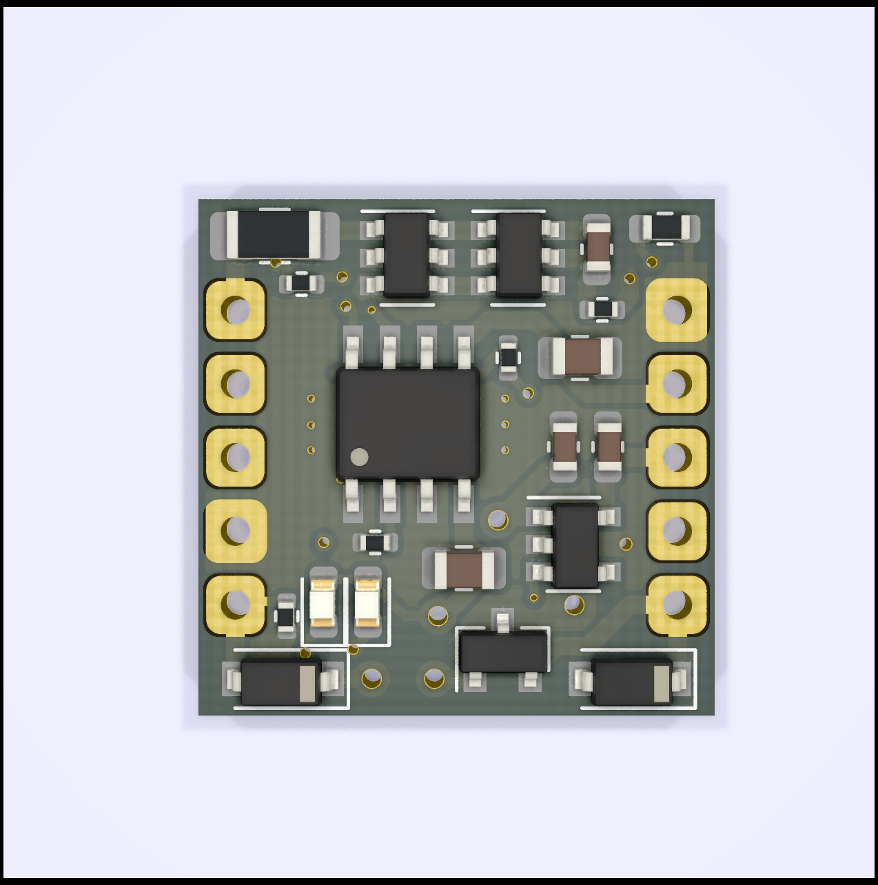
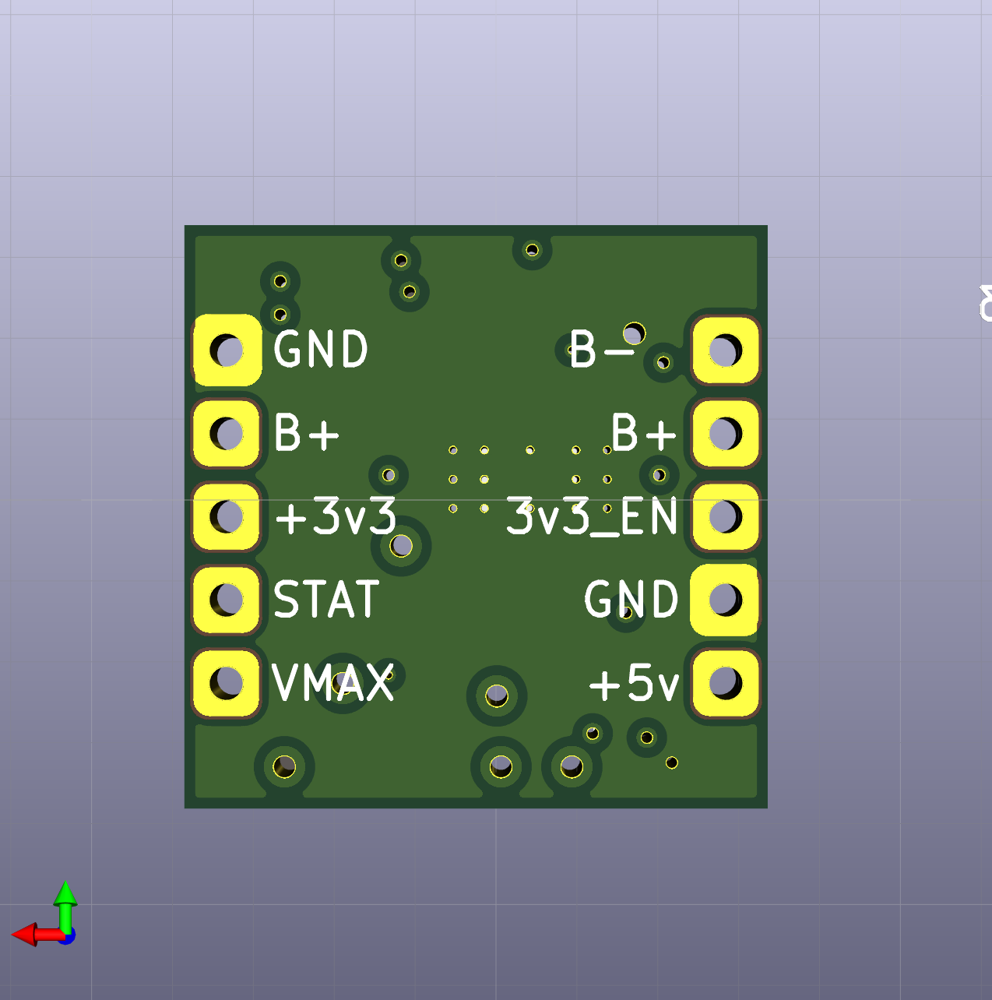
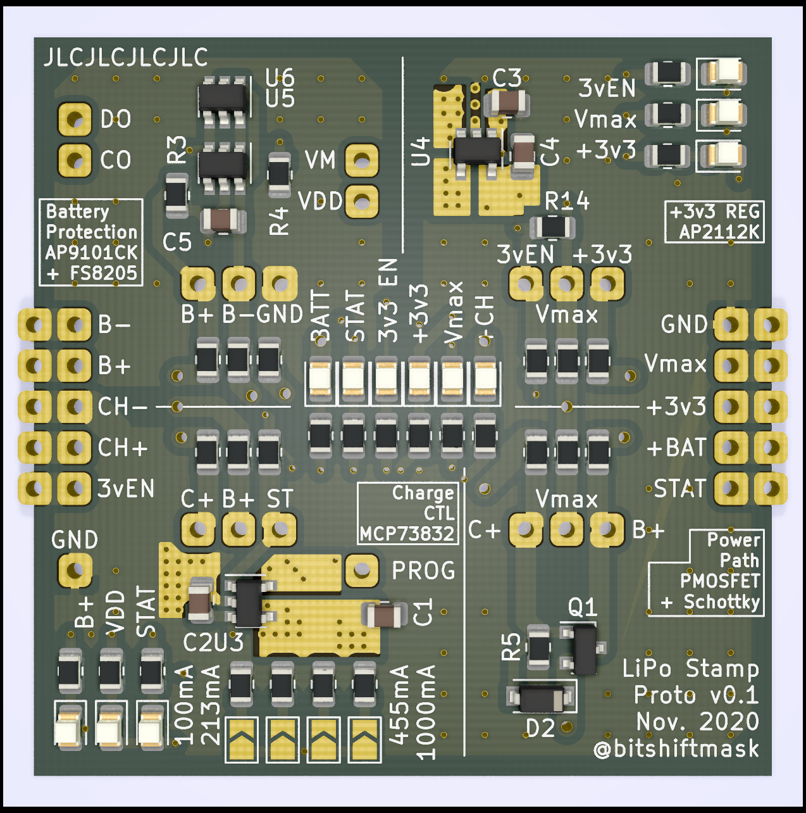

# LiPo Power Stamp

This is intended to be a small sized, general purpose LiPo charge controller with power path and a 3v3 regulator. Currently the targeted size is 0.7" by 0.7", or just under 18mm square. It is intended to be used with 18650 batteries.

## Stamp v0.3.0

This is the current version of the board.

### Design Files

* [Schematic](./assets/stamp-schematic.pdf)
* [Layout](./assets/stamp-layout.pdf)

## Proto Version

The first version is a larger scale test board.

The [schematic](./assets/proto-schematic.pdf) is also available as PDF.

